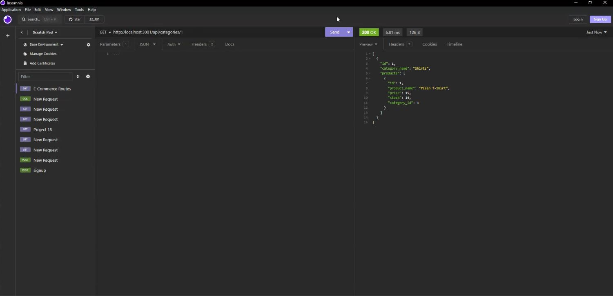

# e-commerce
   

## Description

Have you ever wanted an easy template for an e-commerce back-end? Well, this is the repo for you. I have created Category, Product, Product Tag, and Tag routes for a rudimentary back end in MySQL. This shows my ability to make get, post, put, and delete routes alike in Express!
    
## Table of Contents

- [Installation](#Installation)
- [Usage](#Usage)
- [License](#License)
- [Contributing](#Contributing)
- [Questions](#Questions)
    
## Installation

To install this app, either clone my repo or fork it!

## Usage
    
Here is a handy-dandy walkthrough video about all of the routes you can hit in this repo:

## License

This project is covered under the MIT license. For more information, visit the link below.

[License Link](./LICENSE)

## Contributing

This is a challenge from my edX program, so I won't be accepting any contributions at this time. If you have suggestions, feel free to let me know with an issue!
    
## Questions

Have any questions? This is how to contact me:

Github: https://github.com/RuckusEnjoyer
    